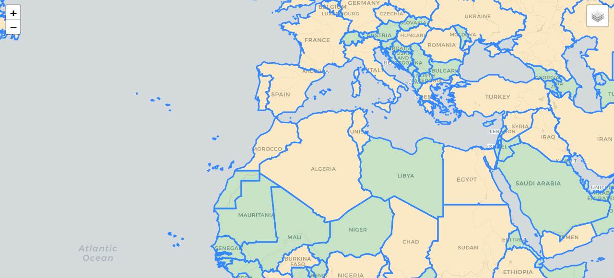
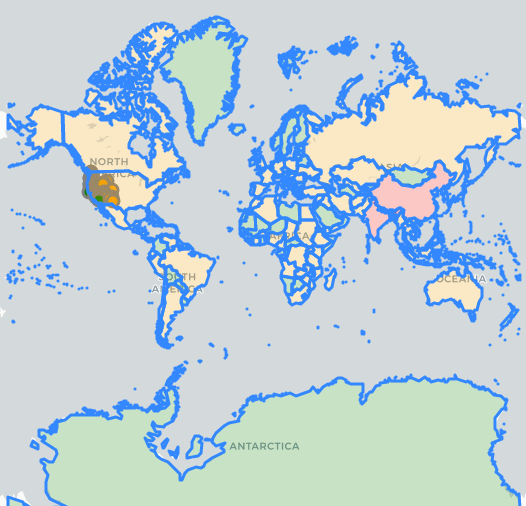
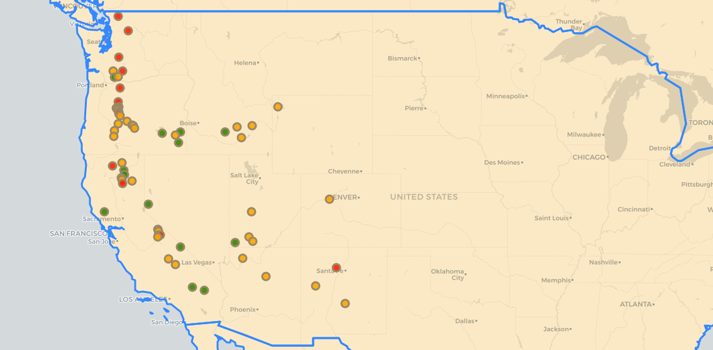
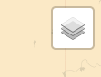
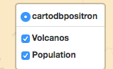

# Webmap-with-Python
Webmap created using Python. 

Used folium python library to create world map. This map displayes population of each country by color. Color 'red' means population greater than or equal to 500000000, color 'orange' means population greater than or equal to 10000000 and less than  500000000, and color 'green' means population less than 10000000.

The map starts on the equator and you can zoom in and out using (+/-) on top left corner of the map 

Here's a view of entire map 

On USA, the dots represents mountains on the west coast. 

Click on each dot to know the mountain's name, height, and location.

You can toggle on and off mountains and population map by clicking layers icon on top right of the map. 

